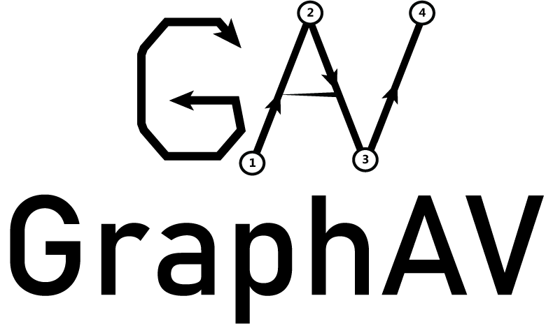

# GraphAV

- A graph algorithms visualizer built using React, Typescript and Styled Components.

- deployed at: https://karimelghamry.github.io/GraphAV/

### Show some :heart: and :star: the repo to support the project

## Features

**[✔]** Light/Dark themes

**[✔]** Add, move and delete nodes

**[✔]** Directed/Undirected edges

**[✔]** Unweighted edges

**[✔]** Control visualization speed

**[✔]** Control canvas zoom percentage

**[✔]** Shortest paths and predecessor node information

**[✔]** Visited nodes/edges animations

**[⛏]** Weighted edges (to be implemented)

## Available Algorithms

**[✔]** DFS - Depth First Search

**[✔]** DLS - Depth Limited Search

**[✔]** IDDFS - Iterative Deepening Depth First Search

**[✔]** BFS - Breadth First Search (with shortest paths calculations)

**[✔]** Dijkstra (with shortest paths calculations)

**[⛏]** Bellman-Ford (to be implemented)

**[⛏]** Floyd-Warshall (to be implemented)

**[⛏]** A\* (to be implemented)

**🎉 If you have any further suggested algorithms, feel free to open an issue! 😎**

## Demos

## Authors

- [Karim Elghamry](https://github.com/KarimElghamry)

- [Ali Amin](https://github.com/Ali-Amin)
